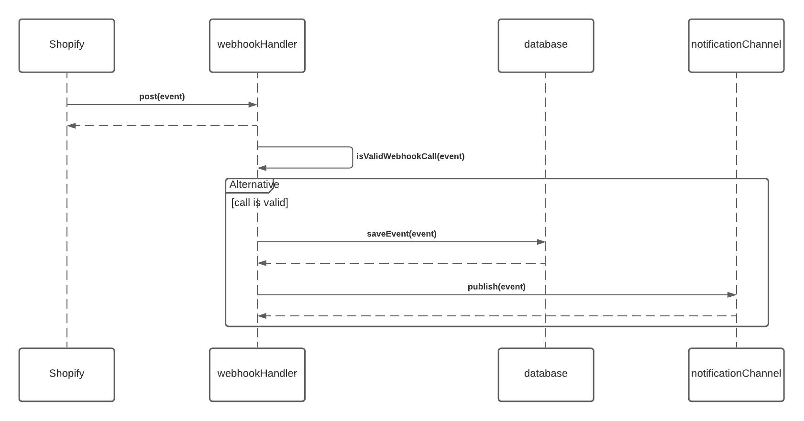

# Getting Starting

To get started with this project you will need to have [Docker](https://www.docker.com/get-started/) and [Yarn](https://yarnpkg.com/getting-started/install) installed.

Once you have **Docker** and **Yarn** working you can begin to download the required dependencies.

```
yarn install
```

If you try to start or test the project, you will notice that it does quite start correctly because of errors related to [Redis](https://github.com/redis/node-redis). **Redis** is a dependency for this but managed by **Docker**, so lets get that up and running.

```
yarn dkr:u
```

Bringing **Docker** up will take some time to do, you'll know that it has finished once you see these lines in your terminal:

```
dev-server_1  | 7:25:25 AM - Found 0 errors. Watching for file changes.
dev-server_1  | [nodemon] starting `node ./dist/index.js`
dev-server_1  | node:14-slim listening on port: 8000
```

To test that the everything is working you can use [Postman](https://www.postman.com/downloads/) to mockup a request.

The easiest way to do that is to use [this data](./__tests__/data/postman-headers.txt) for the headers (change to bulk edit mode and copy/paste) and [this data](./__tests__/data/postman-body.json) for the body.

The response of the request should be a `200` status with the payload being the body data sent plus an additional property

```
{
  "message": "OK"
}
```

Requests that can't be processed will be logged to the terminal.

The best way to run the tests is to connect to the server container (the name should be `shopify-webhook-tutorial_dev-server_1`), then run:

```
yarn test
```

## Description

> **Note: for setup instructions, please refer to [`SETUP.MD`](./SETUP.md)**

The purpose of this project is to handle webhook calls from Shopify and feed the
data in those calls as events to the rest of the system.

When the webhook handler receives a webhook call from Shopify the handler will
perform the following steps in sequence:

1. Validate that the call comes from a valid source
   (see. <https://shopify.dev/tutorials/manage-webhooks#verifying-webhooks> for
   more details). If the call is made by an invalid source, the handler will
   respond with an HTTP 404 status.

2. Persist the incoming event in a database, indexed by the ID of the entity to
   which the webhook relates. For example, a common webhook that we'd subscribe
   to is orders/create which is emitted whenever a new order is created. The
   event payload will contain the details of the created order including the
   entity ID (under the entityId field). This ID can be assumed to be unique in
   the entire orders space, and it can be used as a reference to distinguish
   entities when processing other types of webhook cals, like orders/delete and
   orders/updated.

3. Publish the incoming event to a Pub/Sub notification topic to which other
   systems inside Altitude-Sports subscribe. What these systems do with such an
   event, and whether they actually received it or not is out of the scope of
   this project. Below is a simplified sequence diagram of the logic described
   above:



## Assumptions

- Incoming events contain a current "copy" of the entity to which they refer
- The database offers a key-value semantics, similar to the one offered by
  DynamoDB, Cassandra and Redis Events published to the notification channel
  must be a Base64-encoded string.
- Exposing an HTTP endpoint is already solved and by using Express.js (it's
  implemented in index.ts and you can take a look if you're curious)

## Issues

### Consistency

One of the missing functionalities in the project is the fact that the Shopify
webhook calls might come out of order, meaning that events related to the same
entity could not necessarily arrive in the same order as they were "produced" in
Shopify. Luckily, the events come in with an extra field called serial which
specifies the order in which the event was generated relative to other events
involving the same entity. The type of this field is numeric, it's monotonically
increasing and its initial value is 1.

Right now we're not using that field at all which sometimes causes some
consistency issues due to the fact that we're overwriting data in our database
with stale data. You can imagine the amount of customer pain that this causes.
Leveraging this order information would be ideal in order to mitigate these
pains.

### Bugs

As it stands right now, there are several bugs in the project, and also the
desired functionality is not fully implemented. The challenge is to make sure
that the functionality is correctly implemented and tested so that we can launch
our service once and for all.

Luckily, there are some tests that were written by our team, but due to the bugs
currently present in the code some of those tests are failing. Making those
tests pass would be one requirement since they reflect the expected
functionality of the project.

### Extras

Our team wants to run this service in Kubernetes, but for some reason the app is
failing to connect to the database. If you can troubleshoot this and make it
work that'd be awesome :)
